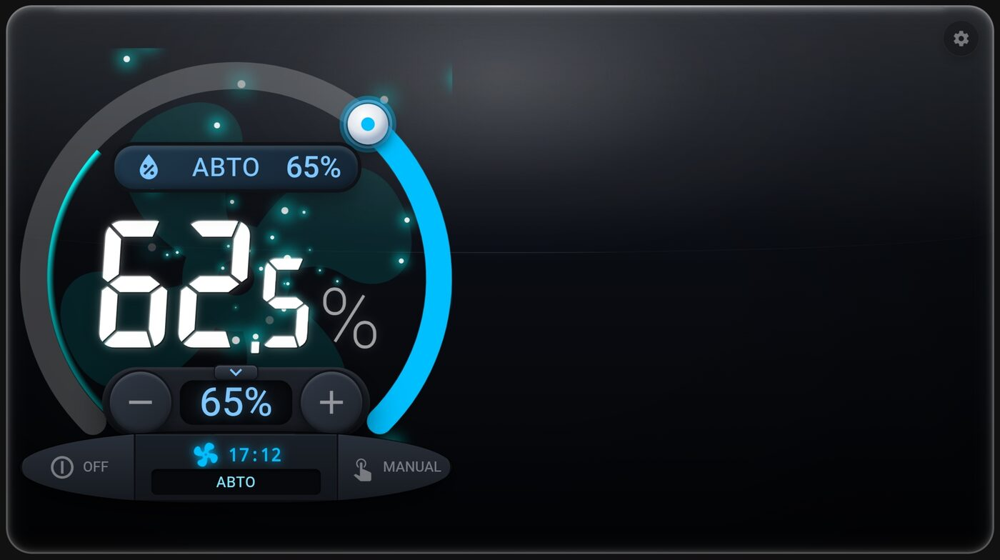
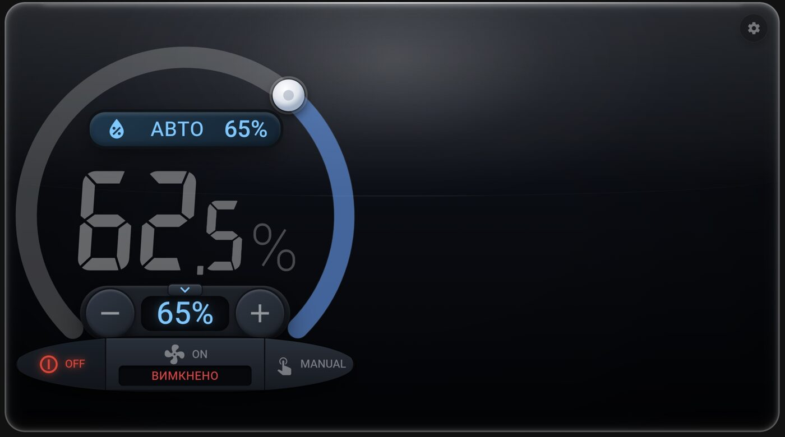
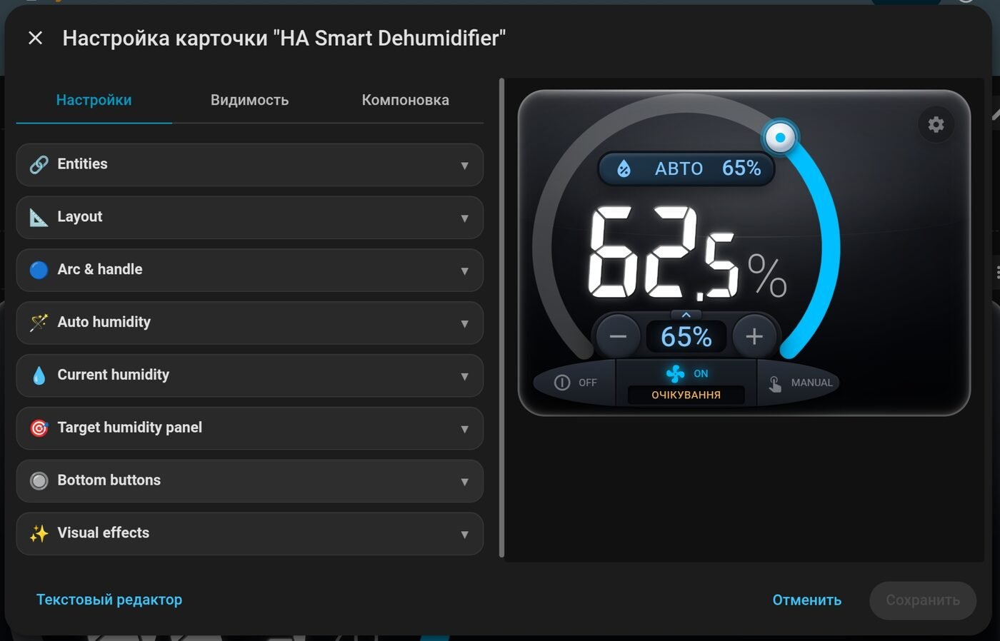

# HA Smart Dehumidifier

🇺🇦 [Українською](README.uk.md)

A Home Assistant integration that turns a plain smart switch into a
full "smart dehumidifier" device, plus a matching Lovelace card.

All the logic — turning the fan on/off, auto mode, manual mode,
timers — runs **inside the integration itself**. You don't need to
create any `input_boolean`, `input_number`, `timer` helpers or
automations; everything below is provided out of the box.



## Features

- Wraps any `switch` entity (a smart plug, a relay, anything) as a
  `humidifier` device with target-humidity control.
- **Auto mode**: calculates a recommended target humidity from an
  adjacent ("reference") room's humidity (optionally correcting for
  the temperature difference between the two rooms), then drives the
  fan with hysteresis so it doesn't chatter.
- **Manual mode**: a one-tap override that runs the fan for a
  configurable duration, then pauses auto mode for a while so it
  doesn't immediately override your manual action.
- Works with **zero optional sensors** too — see
  [Using it without auto-humidity sensors](#using-it-without-auto-humidity-sensors) below.
- A custom Lovelace card with a circular slider, live status, and an
  extensive visual editor (layout, colors, fonts, animations) — no
  YAML required.

## Installation via HACS

1. HACS → Custom repositories → add this repository (category:
   **Integration**).
2. Install "HA Smart Dehumidifier", then **restart** Home Assistant
   (a reload is not enough after the first install).
3. Settings → Devices & services → Add integration → **HA Smart
   Dehumidifier**.

## Setting up a device

When you add the integration you'll be asked for:

| Field | Required? | What it's for |
|---|---|---|
| **Fan switch** | Yes | The real `switch` entity that physically turns the fan on/off. Without it the device can't control anything. |
| **Humidity sensor (dehumidifier room)** | No | Current humidity in the room the dehumidifier is in. Needed for auto mode and for the "current humidity" readout. |
| **Temperature sensor (dehumidifier room)** | No | Used together with the two fields below for temperature-corrected calculations. |
| **Humidity sensor (adjacent room), %** | No | Humidity of a reference/adjacent room, used to calculate a recommended target. |
| **Temperature sensor (adjacent room)** | No | See [Why two temperature sensors](#why-two-temperature-sensors) below. |

**Only the fan switch is required.** Leave any sensor field empty if
you don't have it — the device still works; it just falls back to
simpler behavior (see the two usage modes below). You can add or
change any of these later without recreating the device: **Settings →
Devices & services → HA Smart Dehumidifier → ⋯ → Reconfigure**.

Once the device is created, the integration adds these entities:

| Entity | Type | Purpose |
|---|---|---|
| `humidifier.<name>` | `humidifier` | The main entity — on/off, target humidity, current humidity. This is what you point the card at. |
| `sensor.<name>_status` | `sensor` | Current status: `off` / `connecting` / `auto` / `idle` / `manual` / `manual_auto` / `pause` — see the table below. |
| `sensor.<name>_recommended_humidity` | `sensor` | The auto-calculated recommended target (only meaningful with the humidity sensors configured). |
| `sensor.<name>_absolute_humidity_room` | `sensor` | Absolute humidity (g/m³) of the dehumidifier's room. |
| `sensor.<name>_absolute_humidity_neighbor` | `sensor` | Absolute humidity (g/m³) of the adjacent room. |
| `switch.<name>_auto_mode` | `switch` | Toggles auto mode on/off. |
| `button.<name>_manual_toggle` | `button` | Same action as the card's "MANUAL" button. |
| `number.<name>_delta` | `number` | See [Configuration reference](#configuration-reference). |
| `number.<name>_min_humidity` | `number` | ″ |
| `number.<name>_max_humidity` | `number` | ″ |
| `number.<name>_manual_runtime` | `number` | ″ |
| `number.<name>_manual_pause` | `number` | ″ |

### Why two temperature sensors

The same *relative* humidity at a different temperature holds a
different amount of water in the air, so comparing raw percentages
between two rooms isn't accurate. If **both** temperature sensors are
set, the integration:

1. converts the adjacent room's humidity to absolute humidity (g/m³)
   using its own temperature (Magnus-Tetens formula);
2. adds the configured delta — **also in g/m³** in this mode — to
   that value;
3. converts the result back to a *relative* humidity percentage using
   the dehumidifier room's own temperature — that's the recommended /
   target humidity you see on the card.

If either temperature sensor is missing, the integration automatically
falls back to a direct percentage comparison instead: delta is then in
percentage points, added straight to the adjacent room's humidity
reading. This switch is fully automatic — it also changes the unit of
the `delta` number entity (`%` or `g/m³`) — you never need to flip
anything by hand, adding or removing a temperature sensor is enough.

## Adding the card

**Create the device first (see above), then add the card** — without
a device the card has nothing to show.

The card registers itself automatically; you don't need to add a
Lovelace resource by hand (see
[If the card doesn't show up](#if-the-card-doesnt-show-up-custom-element-doesnt-exist)
if it doesn't). In YAML mode this is all you need:

```yaml
type: custom:ha-smart-dehumidifier
```

Then open the card's **visual editor** and, on the "Entities" tab
🔗, pick the **Device (HA Smart Dehumidifier)** you created — its
main `humidifier` entity. Everything else (the fan switch, sensors,
status, auto-mode switch, the number entities) is discovered by the
card automatically; you never assign them by hand.

Or, in YAML, the same thing in one step:

```yaml
type: custom:ha-smart-dehumidifier
entity: humidifier.smart_xxx
```

All visual settings (layout, the arc, colors, animations, the
7-segment font, bottom buttons, badge, and so on) are configured in
the same visual editor — see [The visual editor](#the-visual-editor)
below for a map of every tab.

## How to use it

### Using it with auto-humidity sensors

This is the mode you get once at least the current-humidity sensor
(and ideally the adjacent-room sensor and both temperature sensors)
are configured:

1. Turn the device **ON** (bottom-left button).
2. Leave **auto mode** on (it's on by default — the badge at the top
   of the card shows "AUTO xx%"). The integration keeps recalculating
   a recommended target humidity from your sensors and keeps the fan
   in sync with it automatically.
3. Tune the calculation to your room once, if needed, via
   `number.<name>_delta` / `_min_humidity` / `_max_humidity` (or the
   gear icon on the card) — see
   [Configuration reference](#configuration-reference).
4. That's it — day to day, you shouldn't need to touch anything.

If you drag the arc, tap +/-, or tap the target-humidity panel, that
becomes a one-off manual override of the *target value* and switches
auto mode off immediately (so the next sensor update doesn't
overwrite your choice) — toggle `switch.<name>_auto_mode` back on
whenever you want the automatic calculation back.

### Using it without auto-humidity sensors

If you only set the fan switch (or don't have the adjacent-room
sensor), the device is still fully usable — it simply has nothing to
calculate a target from, so you drive it manually:

1. Turn the device **ON**.
2. Set a target humidity yourself with the arc / +/- buttons / target
   panel. Manual target changes always turn auto mode off, so this is
   the normal way to operate here — there's nothing to switch off
   first.
3. If you also have *just* a current-humidity sensor for the room
   (without the adjacent-room one), the fan will still turn on/off
   around whatever target you set, using the same hysteresis logic as
   auto mode — you're simply supplying the target by hand instead of
   letting the integration calculate it.
4. With **no** humidity sensor at all, use the **MANUAL** button
   (bottom-right) instead: it runs the fan for a fixed duration
   (`number.<name>_manual_runtime`, 20 minutes by default), then pauses
   for a while (`number.<name>_manual_pause`) before it would consider
   auto behavior again — press it again any time to start another run,
   or press it while running to stop early.

## How auto mode works

The fan turns on and off using an asymmetric hysteresis around the
target humidity (which auto mode calculates for you — see
[Why two temperature sensors](#why-two-temperature-sensors) — or which
you set by hand in manual use):

- **Turns ON** as soon as the current humidity reaches or exceeds the
  target (`current >= target`) — no delay, it reacts immediately.
- **Turns OFF** only once the current humidity drops below the target
  by the configured **hysteresis** (`current <= target − hysteresis`,
  5% by default).

This works the same regardless of *why* the "current − target" gap
changed — whether the humidity itself dropped, or you simply raised
the target. For example, with a 5% hysteresis and a 65% target: the
fan turns on as soon as humidity reaches 65%, and turns off once it
drops to 60% — or immediately, if you raise the target to 65%+ while
humidity is already at 60% or below. The margin only applies to
turning off, so the relay doesn't chatter every time humidity briefly
touches the target.

A few more behavior notes:

- **Manually changing the target** (the slider, +/- buttons, or
  tapping the target panel) turns auto mode off immediately, so the
  very next sensor update doesn't overwrite your choice.
- The **MANUAL** button always inverts the fan's actual state: if it's
  currently running, it pauses it; if it's off, it starts a manual
  timer run (duration is configurable, 20 min by default).
- After a manual run ends (timer elapsed or turned off by hand), a
  **pause** period starts (20 min by default) during which auto mode
  won't touch the fan — this is intentional, so your manual
  intervention isn't immediately overridden by automation.
- The physical switch is also taken into account: turning it on "by
  hand" (not through auto mode) starts a manual run; turning it off
  during a manual run starts the pause.

The device's status sensor (`sensor.<name>_status`) reflects which of
these is currently driving the fan:

| Status | Meaning |
|---|---|
| `off` | Device is off. |
| `connecting` | Device is on, but the current-humidity sensor isn't available yet (typically the first few seconds after HA restarts). |
| `auto` | The fan is actually running because humidity triggered it. |
| `idle` | Device is on, fan is idle — humidity hasn't reached the target yet. |
| `manual` | Manual mode is running, humidity hasn't triggered yet. |
| `manual_auto` | Manual mode is running *and* humidity has triggered at the same time. |
| `pause` | Manual mode just ended — short pause before automatic detection resumes. |

## The visual editor

Open the card's settings (gear icon) to get a tabbed visual editor —
no YAML editing needed for any of this:

| Tab | Covers |
|---|---|
| 🔗 **Entities** | The device (`humidifier`) the card points at. |
| 📐 **Layout** | Card padding, corner radius, alignment, and the "glass" width/height proportions for desktop/wide screens. |
| 🔵 **Arc & handle** | The circular slider — track/handle colors, thickness, drag handle style. |
| 🪄 **Auto humidity** | The "AUTO xx%" badge shown at the top when auto mode is on. |
| 💧 **Current humidity** | The big 7-segment readout — sizes, weight, spacing for the whole-number, decimal, and `%` parts. |
| 🎯 **Target humidity panel** | The number/±-buttons panel under the readout. |
| 🔘 **Bottom buttons** | OFF / fan-status / MANUAL buttons, their labels and icons, and the status badge. |
| ✨ **Visual effects** | The background fan animation, the orbiting "comet", and particle effects. |

## Configuration reference

These can be changed two ways: live, via the gear icon on the card
(saved permanently, survives restarts); or once, as the starting
values, via **Settings → Devices & services → HA Smart Dehumidifier →
Configure**.

| Setting | Default | Range |
|---|---|---|
| Humidity delta vs. adjacent room | 3.75 (`%` or `g/m³`, automatic) | 0–10 |
| Minimum recommended humidity | 65% | 0–100 |
| Maximum recommended humidity | 85% | 0–100 |
| Hysteresis tolerance (Configure only) | 5% | — |
| Manual mode duration | 20 min | 1–180 |
| Pause after manual mode | 20 min | 1–180 |

Min/max recommended humidity only clamp the **auto-calculated**
target. Setting the target by hand (arc, +/- buttons, target panel)
always accepts the full 0–100% range regardless of these limits.

## If the card doesn't show up ("Custom element doesn't exist")

1. Confirm the integration actually loaded: **Settings → System →
   Logs** → search for `ha_smart_dehumidifier`. A resource
   registration error will tell you what to fix.
2. Open the dashboard in a browser, F12 → Network, reload, and check
   the request for `/ha_smart_dehumidifier_files/index.js` — it should
   be **200**, not 404. A 404 means the integration didn't load
   (check the logs) or Home Assistant needs a full **restart** (not a
   reload) after installing via HACS.
3. Hard-refresh the browser cache (Ctrl+Shift+R / Cmd+Shift+R).
4. If none of that helps, add the resource by hand: **Settings →
   Dashboards → ⋮ → Resources → Add resource** → URL
   `/ha_smart_dehumidifier_files/index.js`, type **JavaScript Module**.

## Screenshots

| Auto mode | Off | Visual editor |
|---|---|---|
|  |  |  |

## Development / contributing

- `custom_components/ha_smart_dehumidifier/` — the integration
  (Python).
- `custom_components/ha_smart_dehumidifier/www/` — the card (JS/Lit),
  auto-served by the integration.
- CI: `hassfest` and `HACS validation` (`.github/workflows/`).

Issues and pull requests are welcome.

## License

[MIT](LICENSE)
